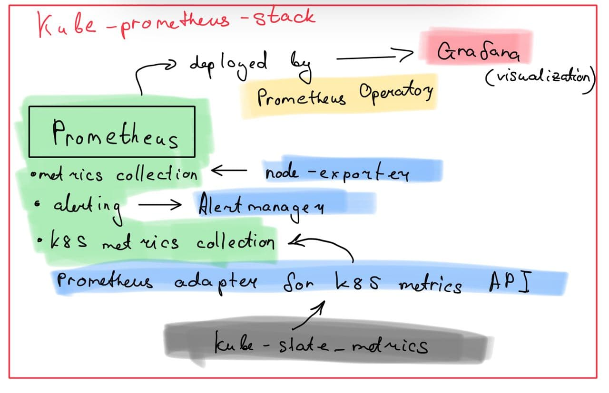
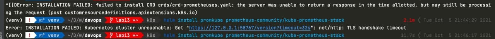
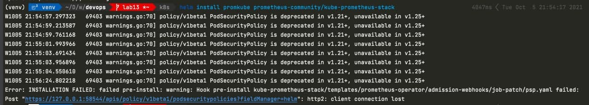
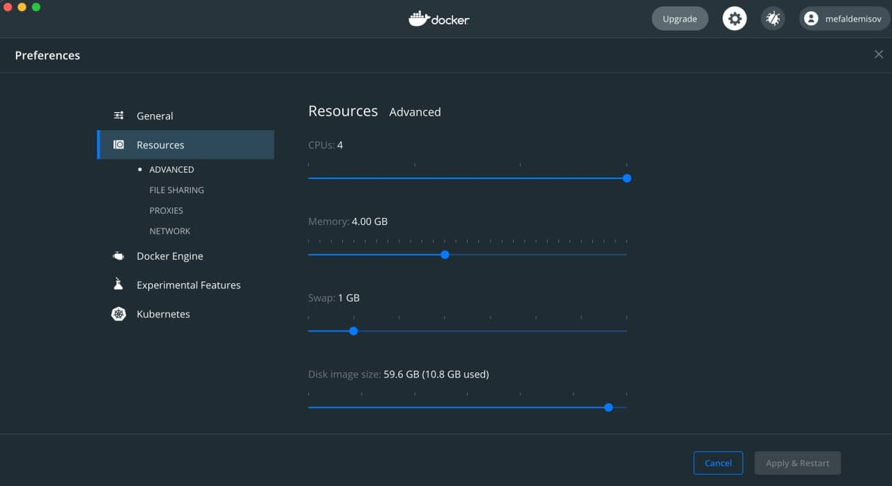
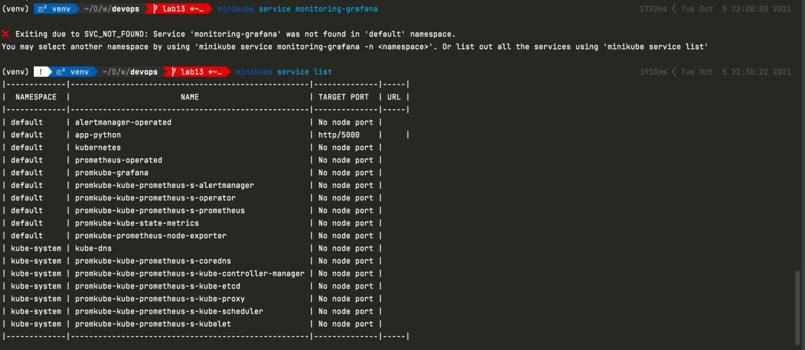
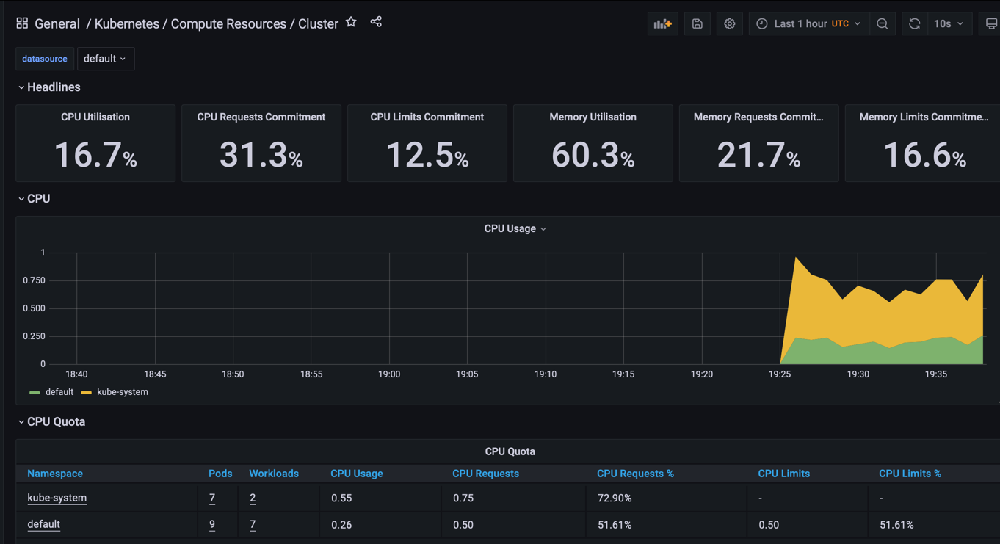
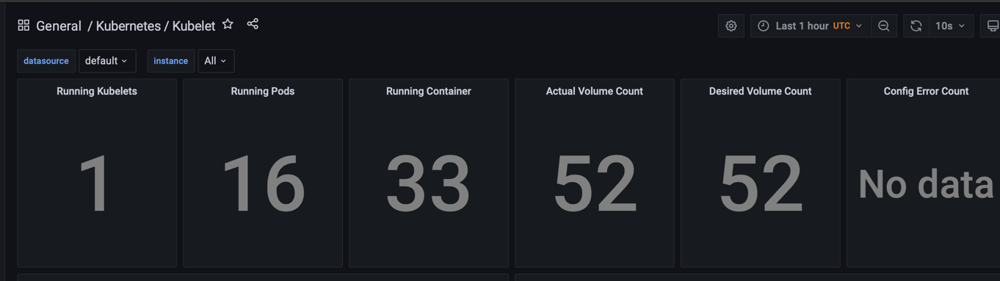
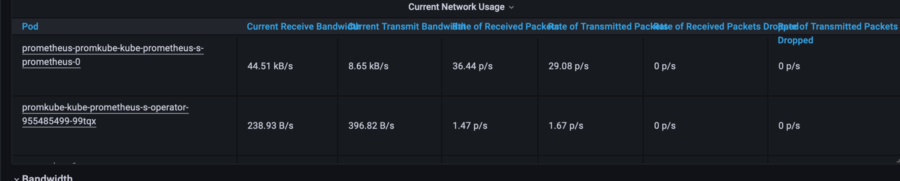
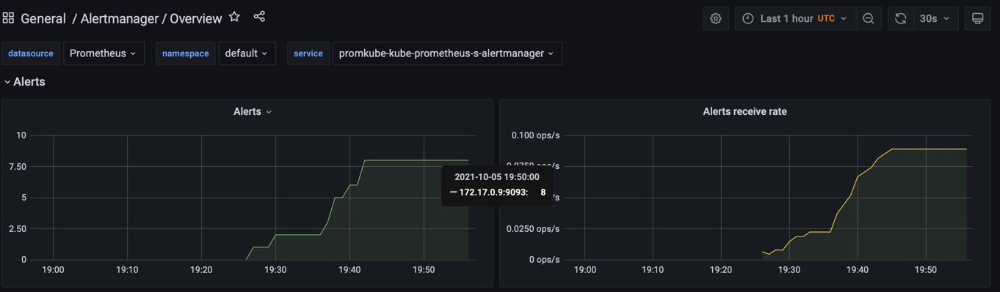
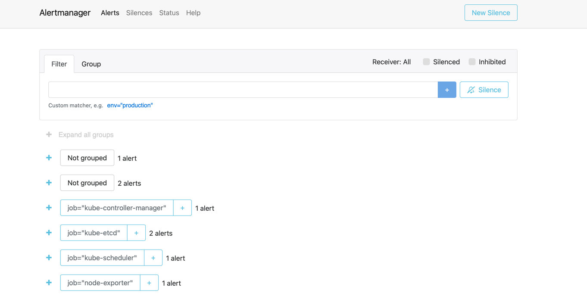

# Lab 14
## Description of components of Kube Prometheus Stack
- **Prometheus Operator** - the deployer of the Prometheus 
- **Prometheus** - the metric-collection tool fot app analysis
- **Alertmanager** - one of the function of Prometheus is alerting; this tool is a middleware, responsible for it
- **Prometheus node-exporter** - the collector of general metrics
- **Prometheus adapter for k8s metrics APIs** - transfers the metrics about k8s to Prometheus
- **Kube-state-metrics** - collector for metrics for k8s
- **Grafana** - visualization of the information, collected by Prometheus


## Problems with installation
(after `helm repo add...` and `helm repo update`)


### Solution: increase RAM limits


## Description of my system

0. `kubectl get po,sts,svc,pvc,cm`
Output:
```bash
NAME                                                         READY   STATUS    RESTARTS        AGE
pod/alertmanager-promkube-kube-prometheus-s-alertmanager-0   2/2     Running   0               3m41s
pod/app-python-0                                             1/1     Running   1 (5m29s ago)   24m
pod/app-python-1                                             1/1     Running   1 (5m29s ago)   24m
pod/app-python-2                                             1/1     Running   1 (5m29s ago)   24m
pod/prometheus-promkube-kube-prometheus-s-prometheus-0       2/2     Running   0               3m29s
pod/promkube-grafana-5c9b5b88f9-mmxth                        2/2     Running   0               4m15s
pod/promkube-kube-prometheus-s-operator-955485499-99tqx      1/1     Running   0               4m15s
pod/promkube-kube-state-metrics-dff57c6f9-b7tds              1/1     Running   0               4m15s
pod/promkube-prometheus-node-exporter-2w8w7                  1/1     Running   0               4m15s

NAME                                                                    READY   AGE
statefulset.apps/alertmanager-promkube-kube-prometheus-s-alertmanager   1/1     3m41s
statefulset.apps/app-python                                             3/3     24m
statefulset.apps/prometheus-promkube-kube-prometheus-s-prometheus       1/1     3m29s

NAME                                              TYPE           CLUSTER-IP       EXTERNAL-IP   PORT(S)                      AGE
service/alertmanager-operated                     ClusterIP      None             <none>        9093/TCP,9094/TCP,9094/UDP   3m43s
service/app-python                                LoadBalancer   10.105.179.72    <pending>     5000:31855/TCP               24m
service/kubernetes                                ClusterIP      10.96.0.1        <none>        443/TCP                      33m
service/prometheus-operated                       ClusterIP      None             <none>        9090/TCP                     3m30s
service/promkube-grafana                          ClusterIP      10.104.137.155   <none>        80/TCP                       4m16s
service/promkube-kube-prometheus-s-alertmanager   ClusterIP      10.111.118.21    <none>        9093/TCP                     4m16s
service/promkube-kube-prometheus-s-operator       ClusterIP      10.96.243.118    <none>        443/TCP                      4m16s
service/promkube-kube-prometheus-s-prometheus     ClusterIP      10.108.240.194   <none>        9090/TCP                     4m16s
service/promkube-kube-state-metrics               ClusterIP      10.100.131.200   <none>        8080/TCP                     4m16s
service/promkube-prometheus-node-exporter         ClusterIP      10.99.68.19      <none>        9100/TCP                     4m16s

NAME                                         STATUS   VOLUME                                     CAPACITY   ACCESS MODES   STORAGECLASS   AGE
persistentvolumeclaim/counter-app-python-0   Bound    pvc-97caf3f9-c97b-4dc3-a5b7-2f9e7edf76d8   128Mi      RWO            standard       24m
persistentvolumeclaim/counter-app-python-1   Bound    pvc-b4d4e72f-5fa7-4618-9933-7df52440a848   128Mi      RWO            standard       24m
persistentvolumeclaim/counter-app-python-2   Bound    pvc-f56b94c8-afbf-44f1-b023-89b660a446d2   128Mi      RWO            standard       24m

NAME                                                                     DATA   AGE
configmap/app-python-config                                              1      24m
configmap/kube-root-ca.crt                                               1      33m
configmap/prometheus-promkube-kube-prometheus-s-prometheus-rulefiles-0   28     3m34s
configmap/promkube-grafana                                               1      4m17s
configmap/promkube-grafana-config-dashboards                             1      4m17s
configmap/promkube-grafana-test                                          1      4m17s
configmap/promkube-kube-prometheus-s-alertmanager-overview               1      4m17s
configmap/promkube-kube-prometheus-s-apiserver                           1      4m17s
configmap/promkube-kube-prometheus-s-cluster-total                       1      4m17s
configmap/promkube-kube-prometheus-s-controller-manager                  1      4m17s
configmap/promkube-kube-prometheus-s-etcd                                1      4m17s
configmap/promkube-kube-prometheus-s-grafana-datasource                  1      4m17s
configmap/promkube-kube-prometheus-s-k8s-coredns                         1      4m17s
configmap/promkube-kube-prometheus-s-k8s-resources-cluster               1      4m17s
configmap/promkube-kube-prometheus-s-k8s-resources-namespace             1      4m17s
configmap/promkube-kube-prometheus-s-k8s-resources-node                  1      4m17s
configmap/promkube-kube-prometheus-s-k8s-resources-pod                   1      4m17s
configmap/promkube-kube-prometheus-s-k8s-resources-workload              1      4m17s
configmap/promkube-kube-prometheus-s-k8s-resources-workloads-namespace   1      4m17s
configmap/promkube-kube-prometheus-s-kubelet                             1      4m17s
configmap/promkube-kube-prometheus-s-namespace-by-pod                    1      4m17s
configmap/promkube-kube-prometheus-s-namespace-by-workload               1      4m17s
configmap/promkube-kube-prometheus-s-node-cluster-rsrc-use               1      4m17s
configmap/promkube-kube-prometheus-s-node-rsrc-use                       1      4m17s
configmap/promkube-kube-prometheus-s-nodes                               1      4m17s
configmap/promkube-kube-prometheus-s-persistentvolumesusage              1      4m17s
configmap/promkube-kube-prometheus-s-pod-total                           1      4m17s
configmap/promkube-kube-prometheus-s-prometheus                          1      4m17s
configmap/promkube-kube-prometheus-s-proxy                               1      4m17s
configmap/promkube-kube-prometheus-s-scheduler                           1      4m17s
configmap/promkube-kube-prometheus-s-statefulset                         1      4m17s
configmap/promkube-kube-prometheus-s-workload-total                      1      4m17s
```
The required service is not called `monitorign-grafana`, but is named `promkube-grafana`, where the `promkube` is the name of the local version of chart of the kube-prometheus-stack


## Stats
1. Check how much CPU and Memory your StatefulSet is consuming.

- To answer this question, `General / Kubernetes / Compute Resources / Cluster` dashboard was used.
StatefulSet is consumed 26% CPU and 892.68 MiB of Memory
2. Check which Pod is using CPU more than others and which is less in the default namespace.
- Such information was taken from dashboard `General / Kubernetes / Compute Resources / Namespace (Pods)`. The pod `prometheus-promkube-kube-prometheus-s-prometheus-0` requested 24% of CPU, while other node requested less
3. Check how much memory is used on your node, in % and mb.
- According to dashboard `General / Node Exporter / Nodes`, 60.2% of memory waw used by my node (1.91GiB)
4. Check how many pods and containers actually ran by the Kubelet service.

- Answer: 16
5. Check which Pod is using network more than others and which is less in the default namespace. 

- Prometheus container is also the winner here
6. Check how many alerts you have. Also you can see them in the Web UI by the `minikube service monitoring-kube-prometheus-alertmanager` command. 

- I think, it is 8
From alertmanager (`minikube service promkube-kube-prometheus-s-alertmanager `)

- 1*4+2*2=8, so, 8 alerts

## Init containers