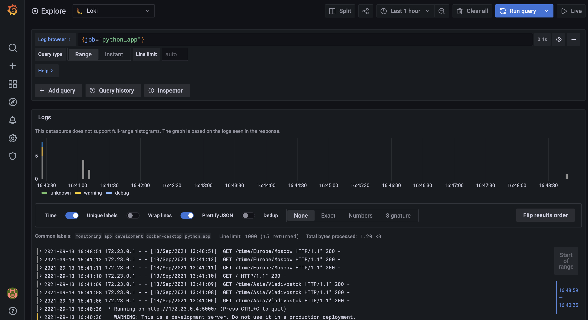
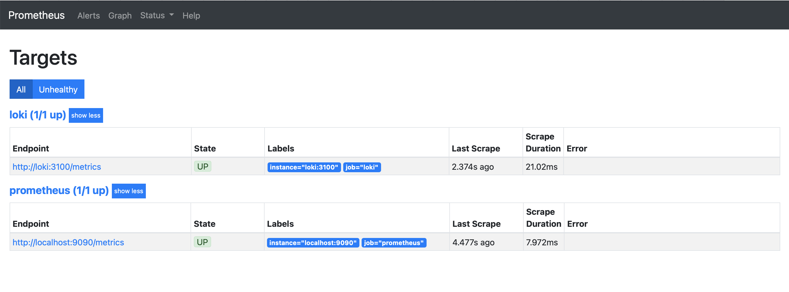
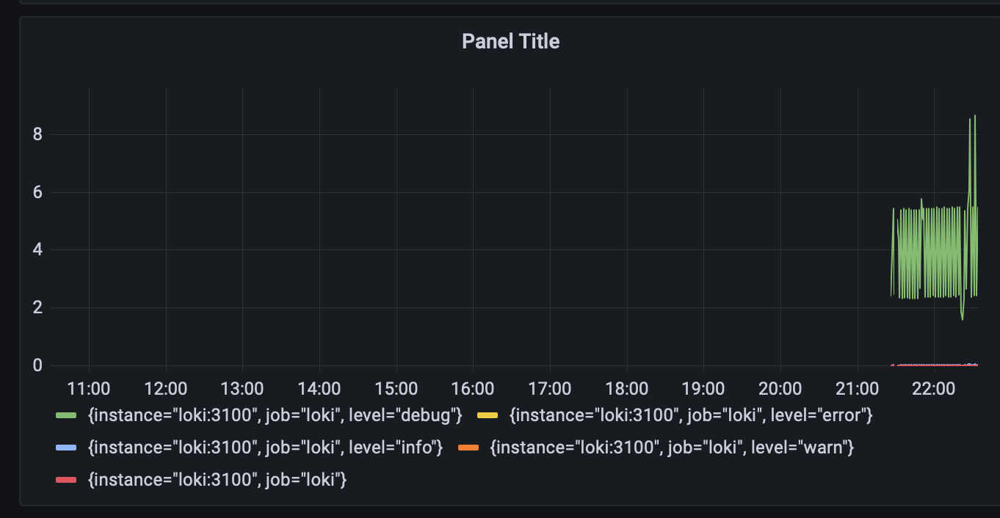

# Logging
## Logging with Grafana

### Process

### Results
#### Grafana + Loki:

#### Requirements:
- docker plugin to log with loki:
```bash
>  docker plugin install grafana/loki-docker-driver:latest --alias loki --grant-all-permissions
```
### Grafana + Loki + Promtail (lab 7)


### Best practices
    
#### Loki
- Both static and dynamic labels should be used
- The values of dynamic labels should have some limits
- Use caching
- The time order should be increasing (thus, the time zone of the servers can make some impact)
- Limit the size of a chunk with `chunk_target_size`

#### Dashboards
- Don't produce many similar dashboards
- Reuse the dashboards with cross-referencing dashboards
- The dashboard should have some exact purpouse or answer some exact question

## Logging with Prometheus
### Output:
http://localhost:9090/targets.

### Some examples from "status" part


## Dashboard
### Dashboard from loki source

### Dashboard from prometheus source


## References
- [Loki label best practices](https://grafana.com/docs/loki/latest/best-practices/)
